# AutoDrive-P3_with_Run-then-walk

<table align="center">
  <tr>
    <td align="center">
      
    </td>
    <td align="center">
      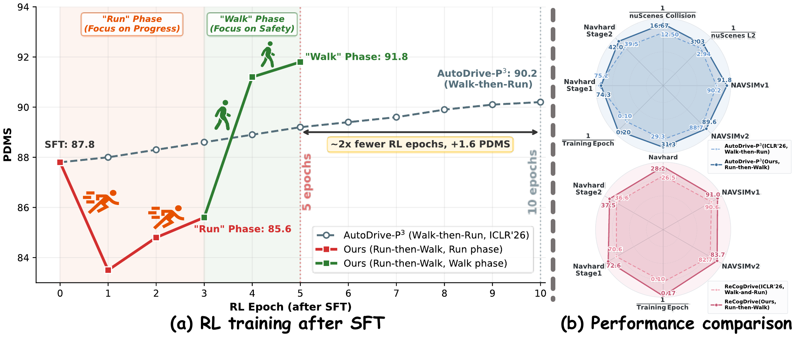
    </td>
  </tr>
</table>

<p align="center">
  <a href="https://openreview.net/forum?id=CMU8GxwpUL">
    
  </a>
  <a href="https://arxiv.org/abs/2609.25831">
    
  </a>
  <a href="https://github.com/haha-yuki-haha/AutoDrive-P3_with_Run-then-walk">
    
  </a>
</p>

## 📖 Overview

AutoDrive-P3 was accepted at ICLR 2026 🎉. This repository provides the stronger
follow-up version of AutoDrive-P3, obtained by applying the Run-then-Walk
method proposed in the subsequent work.

This repository is the public follow-up implementation of AutoDrive-P3. The
root directory directly contains the combined SFT, data, evaluation, and
Run-then-Walk GRPO code. There is no second nested release directory: the code
you need is here.

AutoDrive-P3 supplies the perception-prediction-planning response format and
the NAVSIM data-processing contract. Run-then-Walk supplies the two-stage RL
schedule: first discover higher-progress trajectory modes, then repair safety
and endpoint behavior. The released code, JSON annotations, checkpoint
references, and inference helpers are all for this combined follow-up release.

## 📑 One Release for Two Papers

This GitHub repository is the shared open-source entry point for both papers:

1. **AutoDrive-P3** is the original perception-prediction-planning VLM
   pipeline and response/data contract.
2. **Run-then-Walk** is the follow-up study that applies a staged GRPO schedule
   to the AutoDrive-P3 planner. It starts from the SFT policy, uses a PDMS
   Run phase to discover higher-progress modes, and then uses a safety-aware
   Walk phase to repair those modes.

The Run-then-Walk AutoDrive-P3 experiment reports NAVSIMv1 PDMS of 87.8 for
SFT, 85.7 at the intermediate Run checkpoint, and 91.8 after Walk. The final
policy reaches 91.8 in five RL epochs (three Run epochs followed by two Walk
epochs), compared with the ten-epoch reference schedule discussed in the
paper. This repository therefore combines the original AutoDrive-P3 code
contract with the stronger follow-up training recipe; it is not a separate
reimplementation of an unrelated model.

## 📁 Repository Layout

```text
AutoDrive-P3_with_Run-then-walk/
|-- sft/                         # Qwen2.5-VL supervised fine-tuning
|-- rl/                          # EasyR1/verl GRPO and NavSim rewards
|-- data_process/                # Relative-path NAVSIM data pipeline
|   `-- AutoDrive_P3/            # Released train/test JSON annotations
|-- inference/                   # JSON generation and PDMS evaluation
|-- tools/                       # Small release utilities, including GIF export
|-- assets/figures/              # Run-then-Walk figure
`-- assets/videos/               # Driving demonstration videos
```

The released AutoDrive-P3 annotations are distributed from Hugging Face at
[`Data`](https://huggingface.co/yuki-hahaha/AutoDrive-P3_with_Run-then-walk/tree/main/Data),
not stored in this Git repository. Download the JSON annotations there and
place them under the local data root used by the scripts:

```text
<data-root>/AutoDrive_P3/
  1_RL_train_672_168.json
  1_RL_test_672_168.json
```

The recommended layout is `../data/AutoDrive_P3/`. Set
`AUTODRIVE_P3_ROOT=../data/AutoDrive_P3` before running `data_process.sh`.
Raw NAVSIM sensor logs, maps, metric caches, model weights, and training
checkpoints are also kept outside the code tree and referenced with relative
paths.

## 🧩 Environment

The commands below use the project Python environment. Activate the environment
with `conda activate rl` before running them.

```bash
conda activate rl
python -m pip install -r sft/requirements.txt
python -m pip install -r rl/requirements.txt
```

Install CUDA-compatible PyTorch, flash-attn, vLLM, and DeepSpeed versions for
the local driver. SwanLab logging is offline by default. Cloud logging must be
enabled with `SWANLAB_MODE=cloud` and a secret `SWANLAB_API_KEY`; no token is
stored in this repository.

## 🗂️ Data Processing

Download the AutoDrive-P3 annotations from
[`Data`](https://huggingface.co/yuki-hahaha/AutoDrive-P3_with_Run-then-walk/tree/main/Data)
and place them as shown above. Then process the raw NAVSIM data:

```bash
export NAVSIM_ROOT=../data/navsim
export DATA_ROOT=../data/autodrive_processed
export ANNOTATION_ROOT=../data/autodrive_annotations
export AUTODRIVE_P3_ROOT=../data/AutoDrive_P3
bash data_process/data_process.sh --item all --x 672 --y 168 --workers 8
```

The RL conversion scripts can then build Hugging Face datasets from the
processed JSON and video root:

```bash
python rl/scripts/prepare_rl_data_step1.py \
  --input-json ../data/1_RL_train.json \
  --output-json ../data/2_RL_train.json \
  --video-root ../data/videos \
  --num-workers 16

python rl/scripts/prepare_rl_data_step2.py \
  --input-json ../data/2_RL_train.json \
  --video-root ../data/videos \
  --output-dir ../data/RL_processed_dataset_train \
  --num-workers 16
```

See [`data_process/README.md`](data_process/README.md) for the complete
pipeline and validation checks.

## 🏋️ Training

Build the SFT dataset and train Qwen2.5-VL from a base checkpoint:

```bash
cd sft
DATASET_DIR=../data/SFT_processed_dataset \
MODEL_NAME=Qwen/Qwen2.5-VL-3B-Instruct \
NUM_PROCESSES=8 \
bash scripts/train_sft.sh
```

Run-then-Walk uses the two aligned EasyR1 profiles already included in
`rl/scripts/`:

```bash
cd rl
MODEL_PATH=../models/SFT \
TRAIN_DATA=../data/RL_processed_dataset_train \
VAL_DATA=../data/RL_processed_dataset_val \
NAVSIM_METRIC_CACHE=../data/navsim/metric_cache \
N_GPUS=8 \
bash scripts/train_run.sh

MODEL_PATH=../checkpoints/autodrive/merged_run \
TRAIN_DATA=../data/RL_processed_dataset_train \
VAL_DATA=../data/RL_processed_dataset_val \
NAVSIM_METRIC_CACHE=../data/navsim/metric_cache \
N_GPUS=8 \
bash scripts/train_walk.sh
```

The first stage uses the PDMS profile and the second uses the endpoint plus
DAC/TTC safety profile. Both preserve the original 15-epoch, rollout-8,
learning-rate `1e-6`, KL `1e-3`, eight-GPU parameter alignment. See
`rl/scripts/train_pdms.sh` and `rl/scripts/train_dac_ttc.sh` for the exact
overrides.

## 🔎 Inference

The test scripts cover the original AutoDrive-P3 `final_results.json` row
schema and PDMS evaluation. The dry-run commands are:

```bash
python inference/generate_json.py \
  --dry-run \
  --output-json outputs/final_results.json

python inference/calculate_pdms.py \
  --dry-run \
  --prediction-json outputs/final_results.json \
  --output-json outputs/pdms.json
```

For real inference, pass `--model-path` and `--dataset-dir` to the JSON test.
For official PDMS, replace `--dry-run` with `--metric-cache
../data/navsim/metric_cache`. See
[`inference/README.md`](inference/README.md) for the model input schema and metric
cache requirements.

## 📊 Checkpoint Table

<table>
  <thead>
    <tr>
      <th align="left">Method</th>
      <th align="center">Publication / Checkpoint</th>
      <th align="right">NC ↑</th>
      <th align="right">DAC ↑</th>
      <th align="right">EP ↑</th>
      <th align="right">TTC ↑</th>
      <th align="right">Comf ↑</th>
      <th align="right">NAVSIM ↑</th>
    </tr>
  </thead>
  <tbody>
    <tr><td>TransFuser</td><td align="center">TPAMI 2023</td><td align="right">97.8</td><td align="right">92.6</td><td align="right">78.9</td><td align="right">92.9</td><td align="right">99.9</td><td align="right">83.9</td></tr>
    <tr><td>PARA-Drive</td><td align="center">CVPR 2024</td><td align="right">97.9</td><td align="right">92.4</td><td align="right">79.3</td><td align="right">93.0</td><td align="right">99.8</td><td align="right">84.0</td></tr>
    <tr><td>Hydra-MDP</td><td align="center">CVPR 2024</td><td align="right">98.3</td><td align="right">96.0</td><td align="right">78.7</td><td align="right">94.6</td><td align="right"><strong>100.0</strong></td><td align="right">86.5</td></tr>
    <tr><td>WoTE</td><td align="center">ICCV 2025</td><td align="right">98.5</td><td align="right">96.8</td><td align="right">81.9</td><td align="right">94.9</td><td align="right"><strong>100.0</strong></td><td align="right">88.3</td></tr>
    <tr><td>ImagiDrive</td><td align="center">ICRA 2026</td><td align="right">97.9</td><td align="right">95.5</td><td align="right">80.7</td><td align="right">93.1</td><td align="right">99.9</td><td align="right">86.4</td></tr>
    <tr><td>PWM</td><td align="center">NeurIPS 2025</td><td align="right">98.6</td><td align="right">95.9</td><td align="right">81.8</td><td align="right">95.4</td><td align="right"><strong>100.0</strong></td><td align="right">88.1</td></tr>
    <tr><td>AutoVLA</td><td align="center">NeurIPS 2025</td><td align="right">98.4</td><td align="right">97.5</td><td align="right">81.9</td><td align="right"><strong>98.0</strong></td><td align="right">99.9</td><td align="right">89.1</td></tr>
    <tr><td>AdaThinkDrive</td><td align="center">ICRA 2026</td><td align="right">98.4</td><td align="right">97.8</td><td align="right">84.4</td><td align="right">95.2</td><td align="right"><strong>100.0</strong></td><td align="right">90.3</td></tr>
    <tr><td>DriveVLA-W0</td><td align="center">ICLR 2026</td><td align="right">98.7</td><td align="right"><strong>99.1</strong></td><td align="right">83.3</td><td align="right">95.3</td><td align="right">99.3</td><td align="right">90.2</td></tr>
    <tr><td>AutoDrive-R²</td><td align="center">ICLR 2026</td><td align="right">98.5</td><td align="right">95.9</td><td align="right">82.7</td><td align="right">95.4</td><td align="right"><strong>100.0</strong></td><td align="right">89.1</td></tr>
    <tr><td>AutoDrive-P³</td><td align="center">ICLR 2026</td><td align="right"><strong>98.9</strong></td><td align="right">97.7</td><td align="right">83.7</td><td align="right">96.6</td><td align="right">99.9</td><td align="right">90.2</td></tr>
    <tr><td>ReCogDrive</td><td align="center">ICLR 2026</td><td align="right">98.1</td><td align="right">97.7</td><td align="right">86.5</td><td align="right">94.9</td><td align="right"><strong>100.0</strong></td><td align="right">90.6</td></tr>
    <tr><td>AutoDrive-P3 (Walk-then-Run RL, fast-mode)</td><td align="center">ICLR 2026</td><td align="right"><strong>98.9</strong></td><td align="right">97.7</td><td align="right">83.7</td><td align="right">96.6</td><td align="right">99.9</td><td align="right">90.2</td></tr>
    <tr><td colspan="8"></td></tr>
    <tr><td>AutoDrive-P3 (fast-mode) + SFT</td><td align="center"><a href="https://huggingface.co/yuki-hahaha/AutoDrive-P3_with_Run-then-walk/tree/main/SFT">Hugging Face</a></td><td align="right">98.6</td><td align="right">95.7</td><td align="right">81.7</td><td align="right">95.3</td><td align="right"><strong>100.0</strong></td><td align="right">87.8</td></tr>
    <tr><td>AutoDrive-P3 (fast-mode) + RL stage 1 / Run</td><td align="center"><a href="https://huggingface.co/yuki-hahaha/AutoDrive-P3_with_Run-then-walk/tree/main/RL_stage1_run">Hugging Face</a></td><td align="right">94.8</td><td align="right">95.1</td><td align="right">88.8</td><td align="right">84.8</td><td align="right"><strong>100.0</strong></td><td align="right">85.7</td></tr>
    <tr><td>AutoDrive-P3 (fast-mode) + RL stage 2 / Walk</td><td align="center"><a href="https://huggingface.co/yuki-hahaha/AutoDrive-P3_with_Run-then-walk/tree/main/RL_stage2_walk">Hugging Face</a></td><td align="right">98.6</td><td align="right">97.3</td><td align="right"><strong>88.9</strong></td><td align="right">95.5</td><td align="right"><strong>100.0</strong></td><td align="right"><strong>91.8</strong></td></tr>
  </tbody>
</table>

The NAVSIM score progression is SFT 87.8, Run 85.7, and Walk 91.8. The
sub-metrics and NAVSIM scores are the reported AutoDrive-P3 Run-then-Walk
values from the accompanying study.

## 🎬 Visualization

<table align="center">
  <tr>
    <td><a href="assets/videos/02d79fb826a052b8.mp4">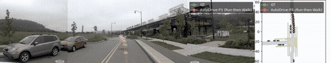</a></td>
    <td><a href="assets/videos/09e659f80a135489.mp4">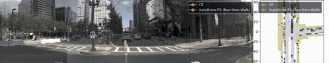</a></td>
    <td><a href="assets/videos/0a9df86bd4525744.mp4">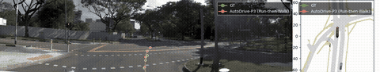</a></td>
  </tr>
  <tr>
    <td><a href="assets/videos/14372e1d773c5a23.mp4">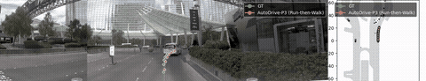</a></td>
    <td><a href="assets/videos/1481ccca03915ab1.mp4">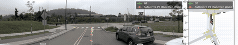</a></td>
    <td><a href="assets/videos/20954f49a4e659af.mp4">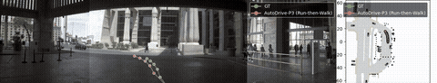</a></td>
  </tr>
  <tr>
    <td><a href="assets/videos/3dcc4d0f431158f9.mp4">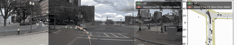</a></td>
    <td><a href="assets/videos/4ac4540129a65bb0.mp4">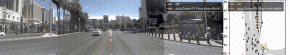</a></td>
    <td><a href="assets/videos/4aea5cf609f8543f.mp4">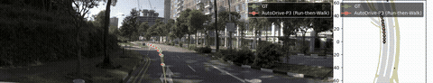</a></td>
  </tr>
  <tr>
    <td><a href="assets/videos/4c7a22bc1dcc5b23.mp4">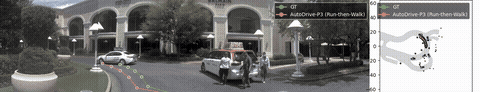</a></td>
    <td><a href="assets/videos/4f4da09be486559a.mp4">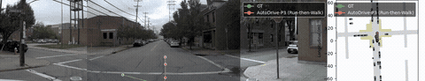</a></td>
    <td><a href="assets/videos/58c3357487cd50be.mp4">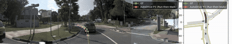</a></td>
  </tr>
</table>

Each animated preview links to its full-resolution MP4. The complete
demonstration set is available in [`assets/videos/`](assets/videos/).

## 📬 Contact

For questions, please contact Yuqi Ye via email (`yeyuqi0303@stu.pku.edu.cn`)
or WeChat (`yuki-hahaha-yuki`).

## 🙏 Acknowledgements

AutoDrive-P3 and this follow-up build on
[EasyR1](https://github.com/hiyouga/EasyR1),
[verl](https://github.com/volcengine/verl),
[TRL](https://github.com/huggingface/trl), and
[NAVSIM](https://github.com/autonomousvision/navsim).

## 📚 Papers

AutoDrive-P3:

```bibtex
@inproceedings{ye2026autodrivep3,
  title={AutoDrive-P3: Unified Chain of Perception-Prediction-Planning Thought via Reinforcement Fine-Tuning},
  author={Ye, Yuqi and Zhang, Zijian and Lin, Junhong and Sun, Shangkun and Peng, Changhao and Gao, Wei},
  booktitle={The Fourteenth International Conference on Learning Representations},
  year={2026},
  url={https://openreview.net/forum?id=CMU8GxwpUL}
}
```

Run-then-Walk:

```bibtex
@article{ye2026sometimes,
  title={Sometimes You Gotta Run Before You Can Walk: Run-then-Walk Scheduling Strategy for VLM Autonomous Driving},
  author={Ye, Yuqi and Sun, Shangkun and Lin, Junhong and Zhao, Jiayi and Peng, Changhao and Zheng, Wei and Liu, Guoqing and Zhao, Tiesong and Gao, Wei},
  journal={arXiv preprint arXiv:2609.25831},
  year={2026},
  url={https://arxiv.org/abs/2609.25831}
}
```
